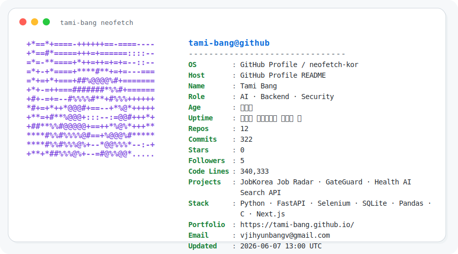

  <picture>
    <source media="(prefers-color-scheme: dark)" srcset="./assets/neofetch-dark.svg">
    <source media="(prefers-color-scheme: light)" srcset="./assets/neofetch-light.svg">
    
  </picture>

  
  

---

## ✨ TamiOS에서 실행 중인 것들

<table>
<tr>
  <td width="24%"><b>🤖 JobKorea Job Radar</b></td>
  <td>
    잡코리아 공고를 수집하고, 상세 정보를 보강하고, 나에게 맞는 공고인지 점수화해서 리포트로 뽑는 채용 자동화 프로젝트
  </td>
  <td width="22%">Python · Selenium · SQLite · Pandas</td>
  <td width="18%">
    <a href="https://github.com/tami-bang/job_crawler">Repo</a> 
    <a href="https://tami-bang.github.io/projects/jobkorea-job-radar">Case Study</a>
  </td>
</tr>

<tr>
  <td><b>🔐 GateGuard</b></td>
  <td>
    패킷 캡처부터 정책 판단, AI 분석, 차단 응답, 관리자 로그까지 연결한 웹 접근 제어 시스템
  </td>
  <td>C · FastAPI · libpcap · MariaDB</td>
  <td><a href="https://github.com/tami-bang/GateGuard">Repo</a></td>
</tr>

<tr>
  <td><b>🏥 Health AI Search</b></td>
  <td>
    증상 입력을 기반으로 의료 정보를 검색하고, LLM 응답까지 이어지는 헬스케어 검색 API
  </td>
  <td>FastAPI · NLP · LLM</td>
  <td><a href="https://github.com/tami-bang/health-ai-search-api">Repo</a></td>
</tr>
</table>

---

## 🧩 README 사용 설명서

- 위 터미널은 매일 GitHub Actions로 다시 부팅됩니다.
- 프로필 사진은 ASCII 스타일로 변환되고, 라이트/다크 모드에 맞춰 색상이 바뀝니다.
- 방문자 수는 badge에서 자동으로 업데이트됩니다.
- 더 자세한 문제 정의와 구현 과정은 포트폴리오에 케이스스터디로 정리합니다.
